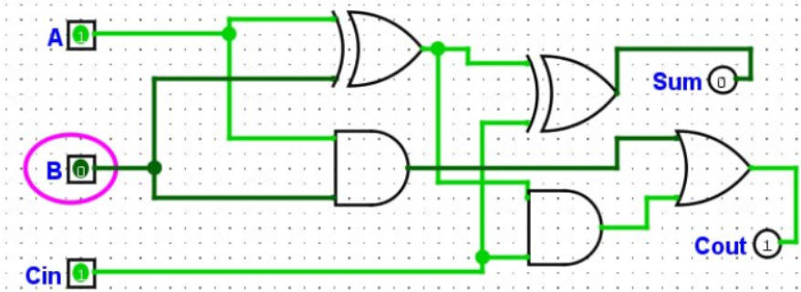

# Домашнє завдання

## Завдання 1

**Функція:** $F = (A \land B) \lor \bar{C}$

Для 3 змінних $(A, B, C)$ кількість рядків дорівнює $2^3 = 8$.

### Таблиця істинності:

| A | B | C | $A \land B$ | $\bar{C}$ | $F = (A \land B) \lor \bar{C}$ |
|:-:|:-:|:-:|:-----------:|:---------:|:------------------------------:|
| 0 | 0 | 0 |      0      |     1     |               1                |
| 0 | 0 | 1 |      0      |     0     |               0                |
| 0 | 1 | 0 |      0      |     1     |               1                |
| 0 | 1 | 1 |      0      |     0     |               0                |
| 1 | 0 | 0 |      0      |     1     |               1                |
| 1 | 0 | 1 |      0      |     0     |               0                |
| 1 | 1 | 0 |      1      |     1     |               1                |
| 1 | 1 | 1 |      1      |     0     |               1                |

---

## Завдання 2

**Початковий вираз:** $\overline{A \lor B} \land (A \lor B)$

### Покрокове спрощення:

1. **Застосовуємо закон де Моргана** до першої частини: $\overline{A \lor B} = \bar{A} \land \bar{B}$
2. **Підставляємо в початковий вираз:** $(\bar{A} \land \bar{B}) \land (A \lor B)$
3. **Застосовуємо закон протиріччя.** Позначивши $X = (A \lor B)$, вираз набуває вигляду: $\bar{X} \land X = 0$

**Висновок:** Результат виразу **завжди дорівнює 0** для будь-яких значень $A$ та $B$, оскільки це є логічним протиріччям (вимога, щоб вираз був одночасно істинним та хибним).

---

## Завдання 3

### Логічні формули повного суматора:

* **Сума ($Sum$):** $Sum = A \oplus B \oplus C_{in}$
* **Перенос ($C_{out}$):** $C_{out} = (A \land B) \lor (C_{in} \land (A \oplus B))$

### Вентилі, що використовуються:

1. **Вихід $Sum$:**
   * Реалізується **2 вентилями XOR** (Виключне АБО).
2. **Вихід $C_{out}$:**
   * Реалізується **2 вентилями AND** (І) та **1 вентилем OR** (АБО).

### Структурна схема:

# Контрольні запитання

## 1. Базові логічні операції та відповідні їм вентилі

* **Заперечення :**
  * Вентиль: NOT 
  * Позначення: $\bar{A}$ або $\neg A$
* **Кон'юнкція :**
  * Вентиль: AND
  * Позначення: $A \land B$ або $A \cdot B$
* **Диз'юнкція :**
  * Вентиль: OR
  * Позначення: $A \lor B$ або $A + B$
* **Виключне АБО :**
  * Вентиль: XOR
  * Позначення: $A \oplus B$

---

## 2. Закони де моргана та приклад їхнього застосування

Закони де Моргана дозволяють виразити заперечення кон'юнкції через диз'юнкцію і навпаки:

1. **Заперечення кон'юнкції:**
   $$\overline{A \land B} = \bar{A} \lor \bar{B}$$

2. **Заперечення диз'юнкції:**
   $$\overline{A \lor B} = \bar{A} \land \bar{B}$$

### Приклад застосування:
Спростити вираз $\overline{A \lor \bar{B}}$:
$$\overline{A \lor \bar{B}} = \bar{A} \land \overline{(\bar{B})} = \bar{A} \land B$$

---

## 3. Різниця між ДДНФ і ДКНФ

* **ДДНФ :**
  * Являє собою **суму (диз'юнкцію) мінтермів** (добутків/кон'юнкцій).
  * Будується за тими рядками таблиці істинності, де значення функції дорівнює **1**.
* **ДКНФ :**
  * Являє собою **добуток (кон'юнкцію) макстермів** (сум/диз'юнкцій).
  * Будується за тими рядками таблиці істинності, де значення функції дорівнює **0**.

---

## 4. Мінімізація логічних функцій та методи її здійснення

**Мета мінімізації:** Спрощення логічного виразу для зменшення кількості потрібних логічних вентилів, входів та зв'язків при фізичному проектуванні цифрової схеми (що зменшує вартість, розмір та енергоспоживання схеми).

### Основні методи:
* **Алгебраїчний метод:** заснований на застосуванні законів та теорем алгебри логіки (закони склеювання, поглинання, де Моргана тощо).
* **Табличний метод (Карти Карно):** графічний спосіб мінімізації для функцій від 2 до 5-6 змінних.
* **Метод Квайна - Мак-Классі:** алгоритмічний метод, зручний для програмної реалізації та мінімізації функцій із великою кількістю змінних.

---

## 5. Різниця між півсуматором і повним суматором

* **Півсуматор :**
  * Додає тільки **два 1-бітних числа** ($A$ та $B$).
  * Має 2 входи ($A, B$) та 2 виходи (Сума $S$, Перенос $C_{out}$).
  * **Не враховує** перенос з попереднього молодшого розряду.
* **Повний суматор (Full Adder):**
  * Додає **три 1-бітних числа**: два операнди ($A$ та $B$) та вхідний перенос з молодшого розряду ($C_{in}$).
  * Має 3 входи ($A, B, C_{in}$) та 2 виходи (Сума $S$, Перенос $C_{out}$).

---

## 6. Різниця між мультиплексором, демультиплексором і дешифратором

| Пристрій | Входи | Виходи | Основна функція |
| :--- | :--- | :--- | :--- |
| **Мультиплексор (MUX)** | Багато інформаційних + Адресні | 1 вихід | Комутує (передає) сигнал з одного з кількох входів на один вихід за адресою. |
| **Демультиплексор (DEMUX)** | 1 інформаційний + Адресні | Багато виходів | Передає сигнал з одного входу на один із багатьох виходів відповідно до адреси. |
| **Дешифратор (Decoder)** | $n$ вхідних ліній | $2^n$ вихідних ліній | Перетворює двоіковий код адреси на активний сигнал на відповідній вихідній лінії. |

---

## 7. Кількість рядків у таблиці істинності для функції 5 змінних

Таблиця істинності матиме **$2^5 = 32$ рядки**.

**Пояснення:** Оскільки кожна з 5 логічних змінних може набувати одного з 2 можливих значень ($0$ або $1$), загальна кількість комбінацій значень обчислюється як $2^n$, де $n = 5$.

---

## 8. Чому в карті Карно використовують код Ґрея, а не звичайний двійковий лічильник

У коді Ґрея сусідні комбінації відрізняються **лише в одному розряді (на 1 біт)**. 

Це є критично важливим для карт Карно, оскільки геометрично сусідні клітинки карти відповідають алгебраїчному закону склеювання ($A \bar{B} \lor AB = A$). Якби використовувався звичайний двоковий код, сусідні клітинки змінювали б по 2 біти одразу (наприклад, $01 \to 10$), і візуально знаходити мінімізовані групи було б неможливо.

---

## 9. Алгебраїчна перевірка еквівалентності спрощеного виразу та вихідної ДДНФ

Щоб перевірити еквівалентність без побудови карти Карно, можна скористатися одним із способів:

1. **Розкриття спрощеного виразу назад у ДДНФ:** застосувати правило $X = X \cdot (Y \lor \bar{Y})$ до спрощеного виразу для всіх відсутніх змінних і переконатися, що отримані мінтерми повністю збігаються з вихідною ДДНФ.
2. **Алгебраїчне зведення ДДНФ до спрощеного виразу:** послідовно застосувати закони алгебри логіки (зокрема закон склеювання $A B \lor A \bar{B} = A$ та закон поглинання) безпосередньо до початкової ДДНФ.
3. **Порівняння значень:** перевірити тотожність виразів шляхом підстановки значень змінних (або порівняння їхніх таблиць істинності).