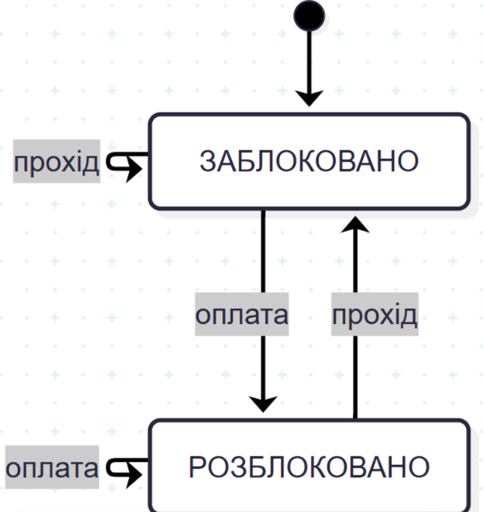

## Завдання 1.

Таблиця переходів показує наступний стан $Q(t + 1)$ залежно від вхідних сигналів $J$ та $K$:

| $J$ | $K$ | Наступний стан $Q(t + 1)$ | Опис / Пояснення |
| :-: | :-: | :-: | :--- |
| **0** | **0** | $Q(t)$ | **Збереження стану** (вихід не змінюється) |
| **0** | **1** | $0$ | **Скидання (Reset)** (вихід стає 0) |
| **1** | **0** | $1$ | **Встановлення (Set)** (вихід стає 1) |
| **1** | **1** | $\bar{Q}(t)$ | **Перемикання (Toggle)** (вихід інвертується) |

**Чому універсальний:** У RS-тригері комбінація $S = 1, R = 1$ є забороненою, а в JK-тригері $J = 1, K = 1$ працює як режим перемикання (Toggle). Окрім цього, JK-тригер може виконувати функції D-тригера та T-тригера при відповідній комутації входів.

---
## Завдання 2

---
## Завдання 3

4-бітний паралельний регістр будується на чотирьох окремих D-тригерах, інформаційні входи D яких приймають окремі біти слова, а всі синхровходи CLK об'єднані в одну спільну тактову лінію, завдяки чому при надходженні єдиного фронту тактового сигналу всі 4 біти (наприклад, 1011) одночасно записуються та фіксуються на виходах Q0...Q3 за 1 такт, на відміну від зсувного регістру, який приймає дані поодинці і вимагає 4 такти для повного запису того самого слова.

# Контрольні запитання

## 1. Принципова різниця між комбінаційною і послідовнісною схемою

* **Комбінаційна схема:** вихідний сигнал залежить **виключно від поточного стану вхідних сигналів** у даний момент часу. Схема не має внутрішньої пам'яті (наприклад: суматори, мультиплексори, дешифратори).
* **Послідовнісна схема (автомат із пам'яттю):** вихідний сигнал залежить **як від поточних входів, так і від попереднього стану системи (пам'яті)**. Схема містить елементи пам'яті — тригери (наприклад: регістри, лічильники, автомати).

---

## 2. Чому JK-тригер вважають універсальнішим за RS-тригер

1. **Відсутність заборонених станів:** У класичному RS-тригері комбінація $S = 1, R = 1$ є забороненою (призводить до невизначеності). У JK-тригері комбінація $J = 1, K = 1$ є робочою і переводить тригер у режим **перемикання (Toggle)**, тобто інвертує поточний стан $Q$.
2. **Універсальність комутації:** На базі JK-тригера можна легко реалізувати інші типи тригерів (D-тригер, T-тригер, RS-тригер) шляхом відповідного об'єднання або підключення його входів.

---

## 3. Різниця між синхронізацією за рівнем і за фронтом

* **Синхронізація за рівнем (Level-triggered / Latch):** тригер реагує на зміну інформаційних входів протягом **усього часу, поки тактовий сигнал (CLK) утримується в певному стані** (наприклад, високий рівень `1`).
* **Синхронізація за фронтом (Edge-triggered / Flip-Flop):** стан тригера змінюється **тільки в короткий момент переходу тактового сигналу** з `0` в `1` (наростаючий фронт) або з `1` в `0` (спадаючий фронт). Протягом решти часу зміни на входах ігноруються.

---

## 4. Чим відрізняється паралельний регістр від зсувного

| Характеристика | Паралельний регістр | Зсувний регістр |
| :--- | :--- | :--- |
| **Введення даних** | Усі біти розрядного слова подаються одночасно на окремі входи. | Біти подаються послідовно один за одним через один вхід. |
| **Запис даних** | Відбувається **паралельно за 1 такт**. | Відбувається **послідовно за $N$ тактів** (де $N$ - кількість бітів). |
| **Зсув інформації** | Відсутній (дані просто зберігаються). | Інформація зсувається від тригера до тригера на 1 розряд з кожним тактом. |

---

## 5. Головна відмінність автомата Мілі від автомата Мура

* **Автомат Мура:** вихідний сигнал $Y(t)$ залежить **тільки від поточного стану автомата** $Q(t)$.
  $$Y(t) = f(Q(t))$$
* **Автомат Мілі:** вихідний сигнал $Y(t)$ залежить **як від поточного стану автомата $Q(t)$, так і від поточних вхідних сигналів $X(t)$**.
  $$Y(t) = f(Q(t), X(t))$$

---

## 6. Приклад використання скінченного автомата в розробці ПЗ

Скінченні автомати (Finite State Machines, FSM) широко використовуються в розробці програмного забезпечення:
* **Парсери та синтаксичний аналіз:** перевірка коректності коду, синтаксису JSON/XML або синтаксису регулярних виразів.
* **Управління станом UI (State Management):** керування станами форм або компонентів (наприклад: *Idle* $\to$ *Loading* $\to$ *Success* / *Error*).
* **Геймдев (Ігрова логіка):** штучний інтелект персонажів (наприклад: *Patrol* $\to$ *Chase* $\to$ *Attack*).
* **Мережеві протоколи:** реалізація з'єднання у протоколі TCP (*LISTEN*, *SYN_SENT*, *ESTABLISHED*, *CLOSE_WAIT*).

---

## 7. Кількість тактів для запису 4-бітного слова у паралельний та зсувний регістри

* **У паралельний регістр:** потрібно **1 такт**, оскільки всі 4 біти подаються паралельно на входи D0–D3 і фіксуються за єдиним фронтом тактового сигналу.
* **У зсувний регістр:** потрібно **4 такти**, оскільки біти вносяться по черзі через один послідовний вхід і з кожним тактом зсуваються на один розряд вглиб регістру.

---

## 8. Чому 3-бітний лічильник з довільним модулем M=6 потребує додаткової комбінаційної логіки

3-бітний лічильник на тригерах має природний модуль лічби $M = 2^3 = 8$ (лічить від `000` до `111`, тобто $0..7$).

Щоб обмежити модуль лічби до M = 6 (значення $0, 1, 2, 3, 4, 5$), потрібна **додаткова комбінаційна схема (наприклад, елемент AND/NAND)**, яка розпізнає появу стану $6$ (`110`) та миттєво подає імпульс скидання (Reset) на асинхронні входи тригерів, повертаючи лічильник у початковий стан `000`.

---

## 9. Визначення стану автомата кодового замка після послідовності входів А, А, В

*(Аналіз кроків за типовою таблицею переходів кодового замка з послідовністю коду А-А-В):*

1. **Початковий стан ($S_0$ - Замкнено):**
   * Надходить вхід **А**: автомат розпізнає перший правильний символ і переходить у стан **$S_1$** (введено першу «А»).
2. **Стан $S_1$:**
   * Надходить вхід **А**: автомат розпізнає другий правильний символ і переходить у стан **$S_2$** (введено «А-А»).
3. **Стан $S_2$:**
   * Надходить вхід **В**: автомат розпізнає третій правильний символ, завершує введення коду і переходить у стан **$S_3$ (Відкрито)** / подає вихідний сигнал відкриття замка.

**Висновок:** Після послідовності входів **А, А, В** автомат опиниться у стані **Відкрито ($S_3$)**.