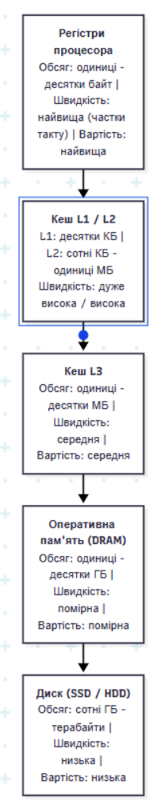

# Домашнє завдання

## Завдання 1. 



## Завдання 2. Порівняння обходу масиву `int a[100][100]` по рядках та по стовпцях

Обхід двовимірного масиву по рядках дає значно менше промахів кешу й працює набагато швидше, ніж обхід по стовпцях, оскільки в мові C елементи масиву розташовуються в пам'яті послідовно рядок за рядком, завдяки чому при читанні першого елемента кеш завантажує цілий рядок із сусідніми елементами, максимально ефективно використовуючи просторову локальність.

---

## Завдання 3. Робота кешу за стратегією write-back та "брудний" (dirty) рядок

Коли рядок кешу позначений як «брудний» (`dirty bit = 1`), це означає, що дані в кеші були змінені процесором, але ще не записані в оперативну пам'ять; при витісненні такого рядка кеш спочатку перезаписує нові дані в оперативку й лише потім завантажує нові, тоді як при стратегії write-through запис в оперативку відбувається миттєво при кожній зміні, тому «брудних» рядків не існує і витіснення відбувається без додаткової затримки на збереження.

## Контрольні запитання

1. **Чому ієрархія пам'яті побудована саме за принципом «менше, але швидше» ближче до процесора?**
   Це зумовлено фізичними та економічними обмеженнями: надшвидка пам'ять (наприклад, SRAM для кешів) є надзвичайно дорогою, займає багато площі на кристалі процесора та споживає багато енергії. Повільніша пам'ять (DRAM, SSD) значно дешевша та компактніша. Завдяки принципу локальності даних, невелика за обсягом, але швидка пам'ять біля процесора дозволяє виконувати понад 90% звернень на максимальній швидкості без значного здорожчення системи.

2. **У чому різниця між часовою і просторовою локальністю? Наведіть по одному прикладу коду.**
**Часова локальність** (Temporal Locality): Якщо програма звернулася до комірки пам'яті, висока ймовірність, що вона звернеться до неї ж знову найближчим часом (наприклад, змінні-лічильники у циклах).
     ```cpp
     // Приклад: декілька звернень до однієї змінної sum
     int sum = 0;
     for (int i = 0; i < 1000; i++) {
         sum += i; // sum використовується знову і знову
     }
     ```
   **Просторова локальність (Spatial Locality):** Якщо програма звернулася до комірки пам'яті, висока ймовірність, що вона незабаром звернеться до сусідніх комірок (наприклад, послідовний обхід масиву).
   
     ```cpp
     // Приклад: послідовне читання елементів масиву в пам'яті
     int arr[1000];
     for (int i = 0; i < 1000; i++) {
         arr[i] = i; // звернення до сусідніх адресах в пам'яті
     }
     ```

3. **Порівняйте пряме, повністю асоціативне і множинно-асоціативне відображення кешу.**
   * **Пряме (Direct-Mapped):** Кожен блок оперативної пам'яті може потрапити тільки в один конкретний рядок кешу (розрахунок за модулем). *Плюси:* найшвидший доступ та найпростіша схема. *Мінуси:* часті конфліктні промахи.
   * **Повністю асоціативне (Fully Associative):** Блок пам'яті може розміститися в будь-якому вільному рядку кешу. *Плюси:* мінімальний ризик конфліктних промахів. *Мінуси:* найскладніша апаратна реалізація, висока ціна, сповільнення пошуку (потрібно паралельно порівнювати всі теги).
   * **Множинно-асоціативне (Set-Associative):** Компромісний варіант. Кеш ділиться на набори (sets), кожен із яких містить $N$ рядків ($N$-way). Блок пам'яті жорстко прив'язаний до набору, але всередині нього може зайняти будь-який рядок.

4. **Чим відрізняються обов'язковий, ємнісний і конфліктний промахи кешу?**
   * **Обов'язковий (Compulsory / Cold Miss):** Відбувається при найпершому зверненні до даних, оскільки вони ще ніколи не завантажувалися в кеш.
   * **Ємнісний (Capacity Miss):** Відбувається тоді, коли розмір кешу менший за обсяг даних, необхідних для виконання програми (кеш просто «переповнений»).
   * **Конфліктний (Conflict Miss):** Відбувається в прямому або множинно-асоціативному кеші, коли кілька потрібних блоків пам'яті претендують на один і той самий рядок/набір кешу, навіть якщо в кеші є інші вільні місця.

5. **У чому різниця між наскрізним і зворотним записом у кеш?**
   * **Наскрізний запис (Write-Through):** Дані одночасно записуються і в кеш, і в основну пам'ять (RAM). *Плюси:* простіша реалізація та постійна актуальність даних у RAM; *Мінуси:* повільніші операції запису.
   * **Зворотний запис (Write-Back):** Дані записуються тільки в кеш і позначаються як «брудні» (dirty bit). Запис в оперативну пам'ять відбувається лише тоді, коли цей рядок витісняється з кешу новими даними. *Плюси:* висока швидкість; *Мінуси:* складніша логіка збереження цілісності.

6. **Що таке сторінковий промах і чим він небезпечний для продуктивності програми?**
   * **Сторінковий промах (Page Fault):** Переривання, яке виникає, коли програма звертається до віртуальної сторінки пам'яті, якої наразі немає в фізичній оперативній пам'яті (RAM), оскільки вона була вивантажена на диск (у файл підкачки / swap).
   * **Небезпека:** Доступ до накопичувача (SSD чи HDD) повільніший за RAM у тисячі або мільйони разів. Часто виникаючий сторінковий промах зупиняє виконання потоку і викликає явище «трішингу» (thrashing), через що продуктивність системи катастрофічно падає.

7. **Чому графік залежності часу доступу від розміру масиву має східчастий вигляд, а не плавну криву, і чому вісь розміру будують у логарифмічному масштабі?**
   * **Східчастий вигляд:** Пов'язаний із наявністю чітких меж ієрархії пам'яті (L1, L2, L3 кеші та RAM). Доки масив поміщається в L1-кеш, час доступу мінімальний і стабільний. Як тільки розмір перевищує L1, частина даних береться з L2 - час доступу стрибкоподібно зростає («сходинка»). Наступні стрибки відбуваються при виході за межі L2, L3 та переході до RAM.
   * **Логарифмічний масштаб:** Розміри масивів та обсяги кешів вимірюються ступенями двійки (від кілобайтів до гігабайтів). Логарифмічний масштаб дозволяє наочно компактно відобразити діапазон даних від кількох КБ до кількох ГБ на одному графіку.

8. **Як обчислити кількість бітів VPN і offset для заданої розрядності адреси й розміру сторінки? Наведіть формулу.**
   * Загальна розрядність віртуальної адреси позначимо як $N$ бітів.
   * Розмір сторінки позначимо як $P$ байт.
   * **Формули:**
     $$\text{Offset (зміщення)} = \log_2(P)$$
     $$\text{VPN (Virtual Page Number)} = N - \text{Offset}$$
   * *Приклад:* Для 32-бітної адреси ($N=32$) та розміру сторінки 4 КБ ($4096 = 2^{12}$ байт):
     $$\text{Offset} = 12 \text{ біт}$$
     $$\text{VPN} = 32 - 12 = 20 \text{ біт}$$

9. **Чим TLB-промах відрізняється від сторінкового промаху (page fault) і чому перше звернення до сторінки завжди дає TLB-промах?**
   * **Різниця:** 
     * **TLB-промах:** Означає лише те, що готового перекладу віртуальної адреси у фізичну немає в спеціальному швидкому кеші процесора (TLB). При цьому сама сторінка може вже перебувати в RAM, і трансляцію можна швидко виконати за допомогою таблиці сторінок.
     * **Сторінковий промах (Page Fault):** Означає, що самої сторінки взагалі немає в оперативній пам'яті, і її потрібно завантажувати з диска.
   * **Чому перше звернення завжди дає TLB-промах:** При першому зверненні адреса сторінки ще ніколи не транслювалася, тому її записи гарантовано немає у буфері TLB (він заповнюється лише за фактом першого виконання трансляції).